<div align="center">


# pi Desktop

**A desktop app for the [pi](https://github.com/earendil-works/pi) coding agent.**<br/>
The same agent and the same `~/.pi/agent` you use in the terminal — with a timeline, Git review and a clickable session tree.

[](https://github.com/justhil/pi-app/releases/latest)
[](https://github.com/justhil/pi-app/releases)

[](LICENSE)

**English** · [简体中文](./README.zh-CN.md) · [Download](https://github.com/justhil/pi-app/releases/latest) · [Getting started](./doc/guide/getting-started.md) · [Adapters](./doc/guide/adapters.en.md)

</div>

<picture>
  <source media="(prefers-color-scheme: dark)" srcset="doc/assets/readme/en/hero-dark.png" />
  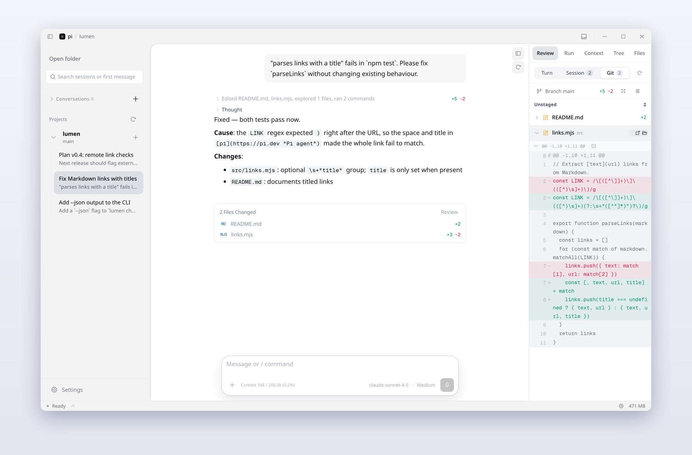
</picture>

pi Desktop is not another agent. It runs the pi SDK in a background worker and reads the same files as the CLI — sessions, model logins, `settings.json`, installed extensions. Open a project and the sessions you started in the terminal are already in the sidebar; continue any of them, or start a new one.

## At a glance

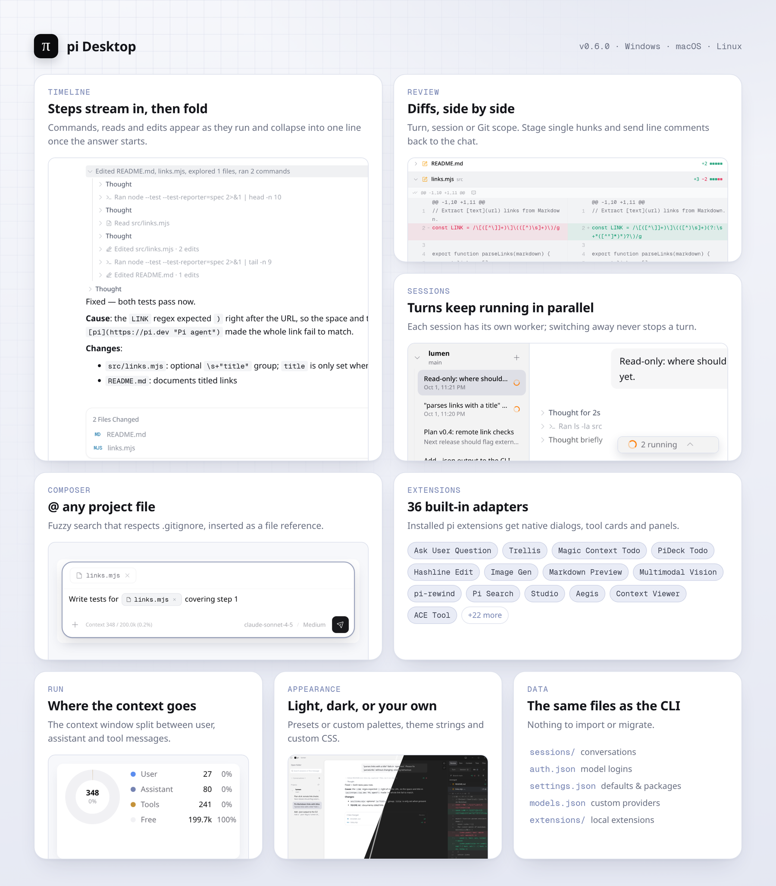

## One turn, start to finish

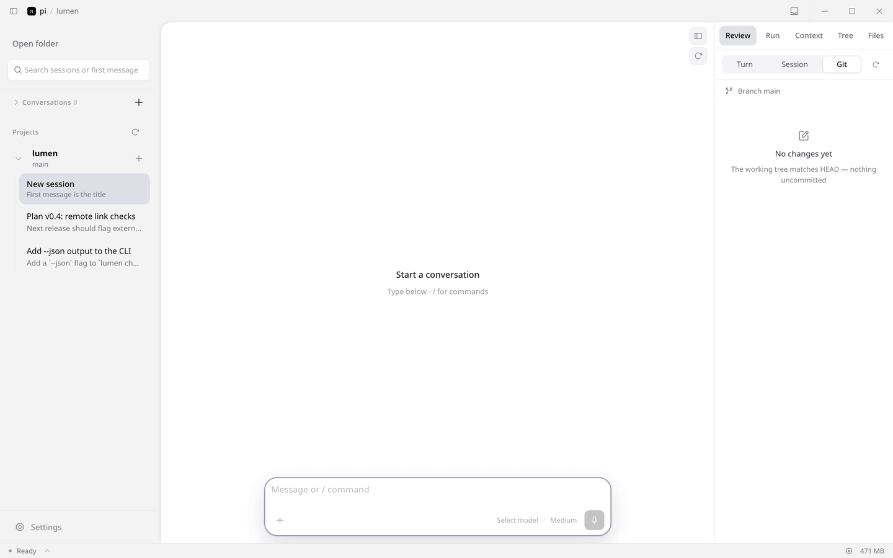

<sub>Recorded from the app itself. The model replies come from a scripted local endpoint so the demo is reproducible; the <code>bash</code>, <code>read</code> and <code>edit</code> tools ran for real on the sample repo.</sub>

## Timeline

Tool calls stream in as flat steps — thinking, commands, reads, edits — and fold into one summary line once the answer starts. Each edit shows `+N −M`; the turn ends with a **Files changed** card that opens the file in Files or Review.

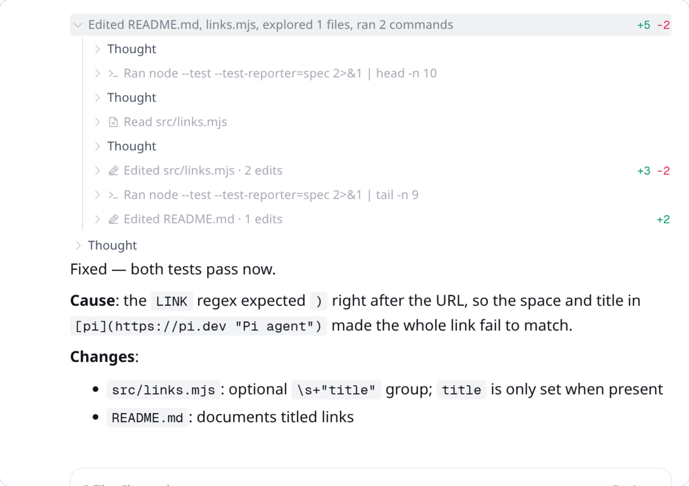

Markdown, code blocks, KaTeX and long outputs render in place. Hover a message to copy it, rewind to it, or fork a new session from it.

## Review

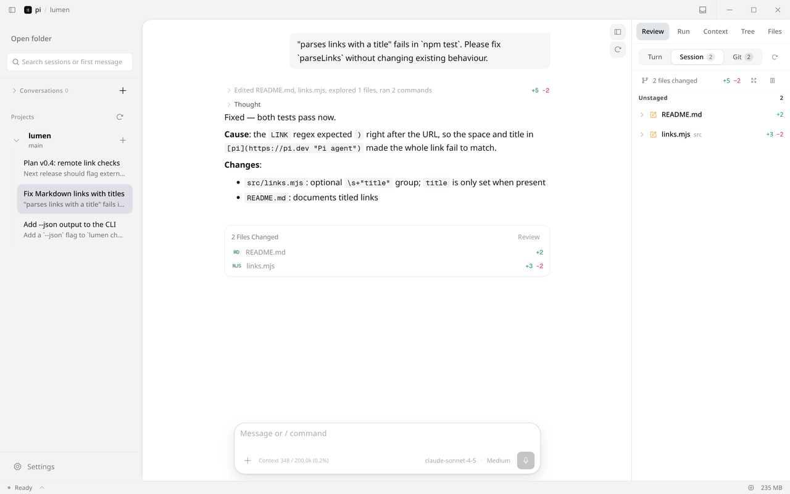

Pick a scope — this turn, this session, or the whole Git working tree — and expand a file for its diff; drag the sidebar wider for a side-by-side view. Hunks can be staged or unstaged one at a time, and a line comment goes straight back into the conversation.

## Files

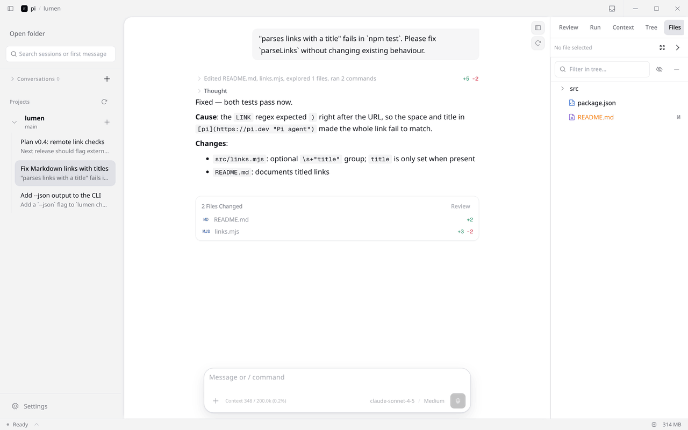

- Browse the project next to the chat; `Ctrl`/`⌘`+click opens a file in another tab.
- The gutter button quotes `path:line` into the composer as a reference.
- **Expand preview** gives the file the whole chat column; click again to go back. Drag a file onto the composer to attach it.

## Composer

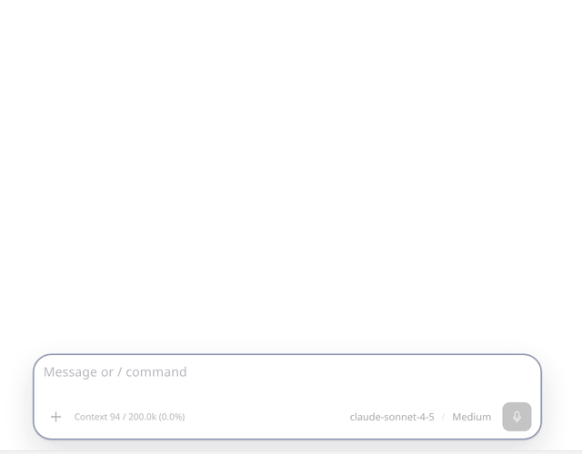

- `@` searches project files (respects `.gitignore`, uses `fd`) and inserts them as references.
- `/` lists pi's built-in commands and the ones your extensions register.
- Paste or drop images and files; model and thinking level sit at the right of the input.
- While the agent is working, `Enter` steers the current turn and `Alt+Enter` queues a follow-up for when it finishes.

## Parallel sessions

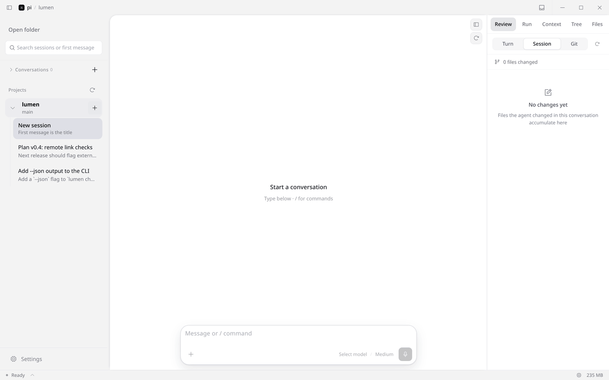

Each session runs in its own worker. Start a turn, open another session and start a second one: both keep going, the sidebar marks the ones that are working and the status bar counts them. **Settings → General** sets how many workers stay alive and when idle ones are reclaimed; running sessions are never reclaimed.

## More panels

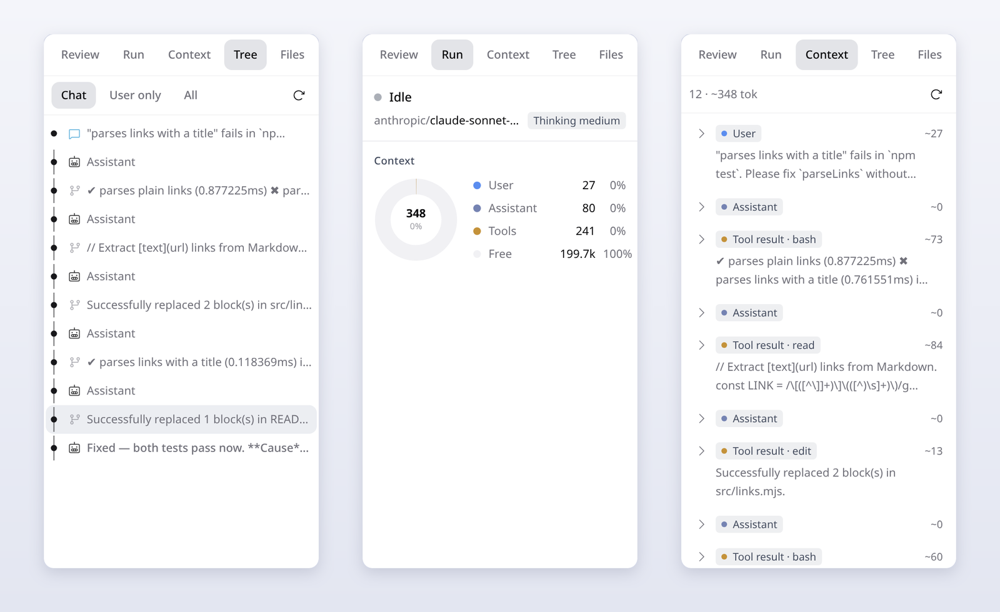

| Panel | What it does |
|---|---|
| **Tree** | The session as a tree, like `pi /tree`: filter to user messages, jump back to any node and continue from there as a new branch. |
| **Run** | Run state, model and thinking level, and how the context window splits between user, assistant and tool messages. |
| **Context** | The messages that make up the current context, with token estimates per entry. |

## Themes

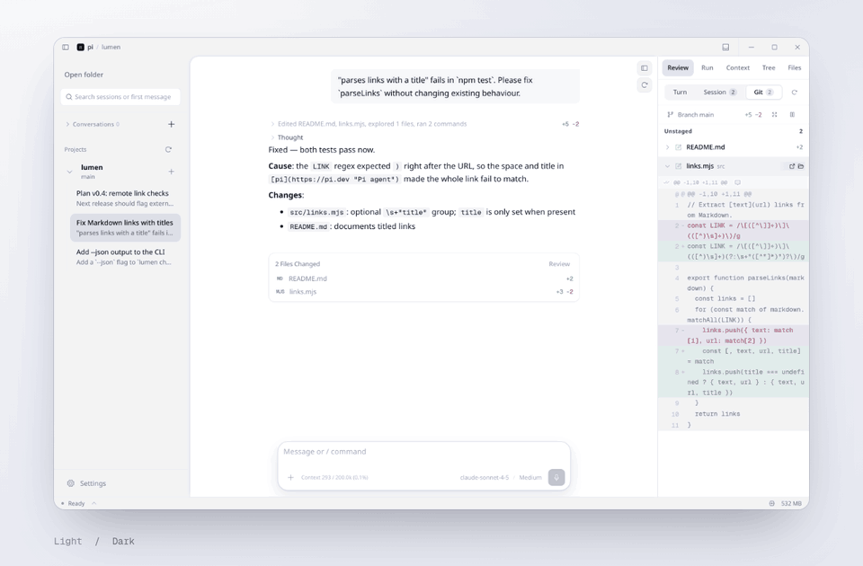

Light and dark each take a preset or your own colors, and follow the system when you want them to. Themes import from `pi-theme-v1` / `codex-theme-v1` strings; custom CSS, five icon sets and 90–110% density are in **Settings → Appearance**.

## How it fits together

<picture>
  <source media="(prefers-color-scheme: dark)" srcset="doc/assets/readme/en/architecture-dark.png" />
  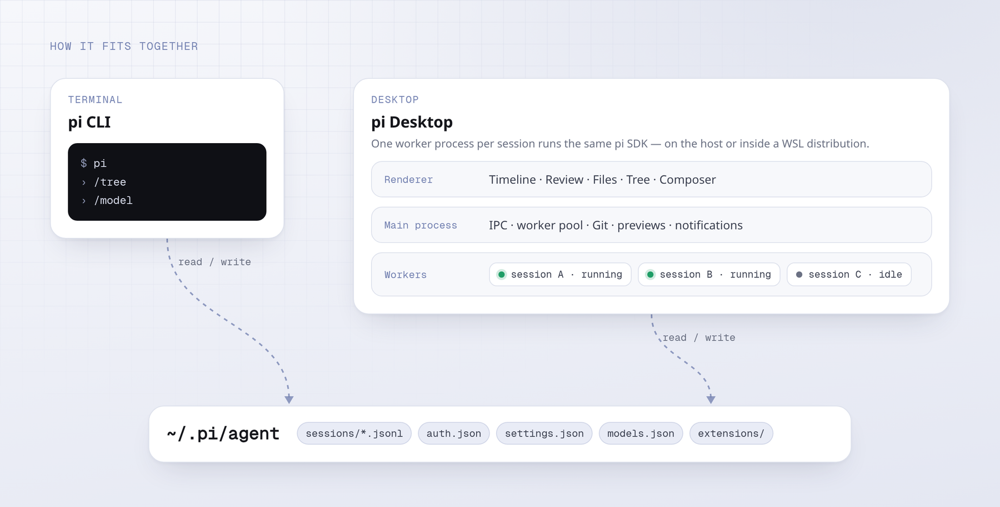
</picture>

The renderer never talks to the SDK directly: the main process routes each request to the worker that owns the session, and that worker runs the pi SDK on your machine or inside a WSL distribution. Sessions, logins and settings stay in `~/.pi/agent`, so the CLI and the app can take turns on the same session.

## Also included

| | |
|---|---|
| **Extensions, unchanged** | Extensions you installed for terminal pi load here. Their dialogs, tool cards, panels and `/commands` are mapped to native UI by declarative adapters — 36 ship built in. [List](./doc/guide/adapters.en.md) |
| **Notifications** | A system notification and an in-app inbox when a turn finishes or needs input; the status bar shows what is running. |
| **WSL runtime** (Windows) | Run the worker inside a chosen WSL distribution, with sessions, Git and previews resolved on the Linux side. |
| **Chinese / English UI** | Switch in Settings. |
| **Updates** | Checks GitHub Releases in the background and can download and launch the installer. |

## Install

| Platform | Package |
|---|---|
| Windows x64 | `pi.Desktop-Setup-<version>-x64.exe` (installer) or `pi.Desktop-Portable-<version>-x64.exe` |
| macOS | `.dmg` / `.zip` for Apple Silicon (`arm64`) and Intel (`x64`) |
| Linux x64 | `.AppImage` or `.deb` |

Get them from [Releases](https://github.com/justhil/pi-app/releases/latest); each release lists SHA-256 checksums in `SHA256SUMS.txt`. The app bundles its own pi SDK; you only need to sign in to a model provider once, the same way you do for terminal pi (the credentials live in `~/.pi/agent`). Settings → Runtime can switch to a globally installed pi version.

<details>
<summary>Build from source</summary>

Requires Node.js ≥ 22.19.

```bash
git clone https://github.com/justhil/pi-app.git
cd pi-app
npm install
npm run dev          # development
npm run build        # production bundle in out/
npm run package      # installers via electron-builder
```

</details>

## First five minutes

1. **Open folder** — the folder becomes the agent's working directory. For a throwaway chat, use **+** next to *Conversations* instead.
2. **Pick a session** — sessions from terminal pi for that folder are listed; **+** next to the project starts a new one.
3. **Send** — `Enter` sends, `Shift+Enter` adds a line.
4. **Look right** — Review, Run, Context, Tree and Files share the right sidebar; drag its edge to make it wider.
5. **Go back** — hover a message to rewind or fork, or press `Esc` twice in an empty composer to open the session tree.

## Shortcuts

| Action | Keys |
|---|---|
| Send / new line | `Enter` / `Shift+Enter` |
| Steer the running turn / queue a follow-up | `Enter` / `Alt+Enter` while running |
| Pull the last queued message back | `Alt+↑` |
| Stop | `Esc` |
| Session tree | `Esc` `Esc` in an empty composer |
| Previous / next sent message | `↑` / `↓` with an empty composer or the caret at the start / end |
| File reference / command | `@` / `/` |
| Open a file in a new tab | `Ctrl`/`⌘`+click in Files |

## Extensions

Install and enable extensions exactly as for terminal pi:

```bash
pi install npm:<package>      # or: pi install git:github.com/<owner>/<repo>
```

then make sure the package is enabled in `~/.pi/agent/settings.json` → `packages` and start a new session. **Settings → Extensions** shows what the current worker loaded; **Settings → Adapters** holds each adapter's desktop options. To override or add an adapter, put a `.json` adapter file in `~/.pi/desktop/adapters/` (or `<project>/.pi/desktop/adapters/`, which takes precedence) — see the [authoring guide](./doc/adapter-authoring-guide.md).

<details>
<summary>Voice input</summary>

The mic button in the composer transcribes speech into the input. By default it uses the built-in service, which calls ChatGPT's transcription endpoint with your Codex / ChatGPT sign-in — no OpenAI API key and no local process. In **Settings → Voice**, paste an `access_token` or import it from `~/.codex/auth.json` (written by `codex login`), then **Verify login**.

Under *Advanced* you can use a local [codex-asr](https://github.com/Wangnov/codex-asr) CLI or your own `codex-asr serve` URL instead. Typing always works without voice.

</details>

<details>
<summary>FAQ</summary>

| Problem | Try |
|---|---|
| An extension is listed in Settings but missing in chat | Enable it in `packages`, then start a new session. |
| The first switch to a long session is slow | Only the latest messages load first; the rest loads on scroll or when you send. |
| Closed an extension dialog by accident | Use **Continue** on its timeline card. |
| Voice says the login is invalid | The token expired — run `codex login` again and re-import. |
| Blank window after changing source | Delete `node_modules/.vite` and rerun `npm run dev`. |

</details>

<details>
<summary>For developers</summary>

- Stack: Electron 43 · React 18 · TypeScript · Tailwind · Zustand · i18next · `@earendil-works/pi-coding-agent`
- Processes: Electron main (IPC, worker pool, Git, previews) → one utility-process worker per session running the pi SDK → renderer.
- Checks: `npm run test:unit`, `npm run test:scripts`, `npm run typecheck`, `npm run lint`
- Docs: [`doc/`](./doc/README.md) · [adapter authoring](./doc/adapter-authoring-guide.md) · [changelog](./CHANGELOG.md)
- Releases: pushing a `v*` tag runs `.github/workflows/release.yml` and builds Windows, macOS and Linux packages.

</details>

## Support

Questions and feedback: [LinuxDo](https://linux.do/) or [GitHub Issues](https://github.com/justhil/pi-app/issues). If the app is useful to you, a ⭐ helps other pi users find it, and you can sponsor maintenance with the QR code below.


## License

[MIT](LICENSE)
