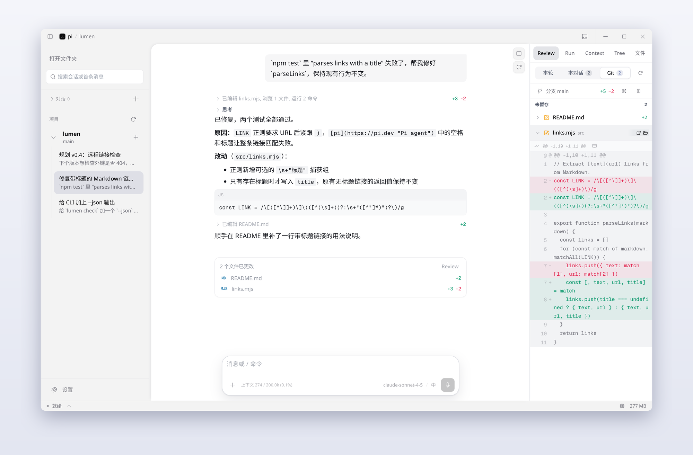
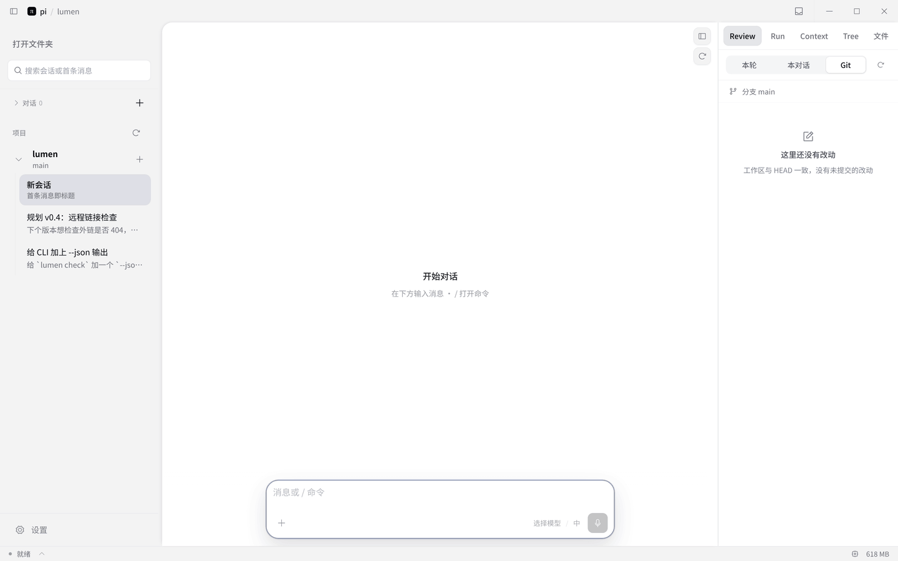
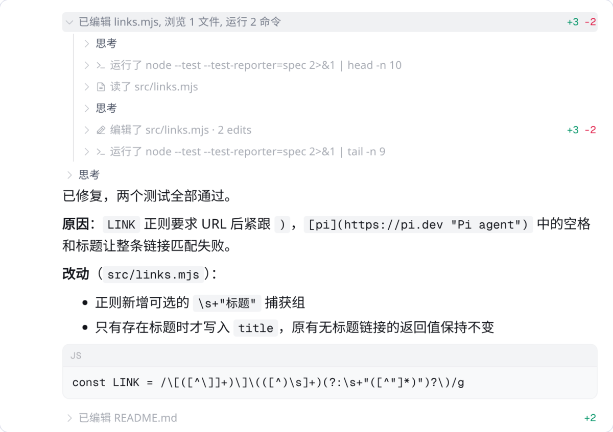
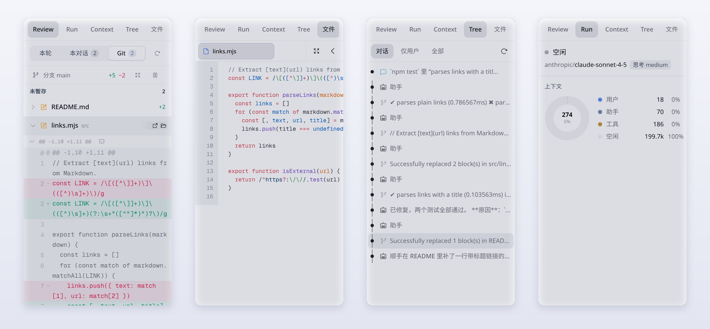
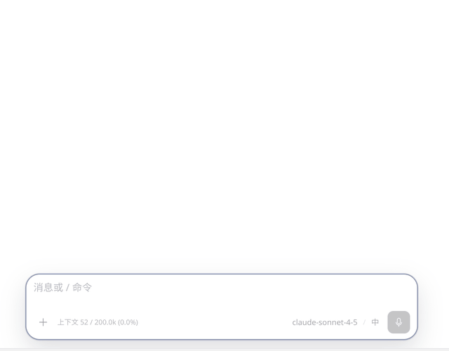

<div align="center">


# pi Desktop

**[pi](https://github.com/earendil-works/pi) 编程 Agent 的桌面客户端。**<br/>
还是终端里那个 Agent、那份 `~/.pi/agent`，多了时间线、Git Review 和可点击的会话树。

[](https://github.com/justhil/pi-app/releases/latest)
[](https://github.com/justhil/pi-app/releases)

[](LICENSE)

[English](./README.md) · **简体中文** · [下载](https://github.com/justhil/pi-app/releases/latest) · [上手指南](./doc/guide/getting-started.md) · [适配器列表](./doc/guide/adapters.zh-CN.md)

</div>

<picture>
  <source media="(prefers-color-scheme: dark)" srcset="doc/assets/readme/zh/hero-dark.png" />
  
</picture>

pi Desktop 不是另一个 Agent。它在后台 Worker 里运行 pi SDK，读写的就是 CLI 用的那些文件：会话、模型登录、`settings.json`、已安装的扩展。打开项目，终端里聊过的会话已经在侧栏里，接着聊或者新开都行。

## 一轮对话的全过程



<sub>直接录自应用界面。为了让演示可复现，模型回复来自本地脚本化接口；<code>bash</code>、<code>read</code>、<code>edit</code> 工具都在示例仓库上真实执行。</sub>

## 时间线

工具调用按步骤平铺流式出现——思考、命令、读文件、改文件——正文开始输出后折叠成一行摘要。每次编辑标出 `+N −M`，回合结束时附一张「文件已更改」卡片，点开即可在 Files 或 Review 中查看。



Markdown、代码块、KaTeX 和长输出都在原位渲染。悬停消息可以复制、回退到此处，或从这里 Fork 一个新会话。

## 右侧面板



| 面板 | 用途 |
|---|---|
| **Review** | 按「本轮 / 本对话 / Git 工作区」查看改动。展开文件看行内 diff，可按 hunk 暂存或撤销，也能把行评发回当前对话。 |
| **文件** | 项目文件树 + 多标签预览（`Ctrl`/`⌘`+点击），语法高亮；宽屏模式可铺满对话区。把文件拖到输入框即可作为附件。 |
| **Tree** | 像 `pi /tree` 一样以树形查看会话：只看用户消息、跳回任意节点，从那里继续就是一条新分支。 |
| **Run** | 运行状态、当前模型与思考等级，以及上下文窗口在用户、助手、工具消息之间的占比。 |
| **Context** | 组成当前上下文的消息列表，每条附 token 估算。 |

## 输入框



- `@` 搜索项目文件（遵守 `.gitignore`，基于 `fd`），插入为文件引用。
- `/` 列出 pi 内置命令和扩展注册的命令。
- 可粘贴、拖入图片和文件；模型与思考等级在输入框右侧切换。
- Agent 运行中：`Enter` 插话引导当前回合，`Alt+Enter` 排队到本轮结束后执行。

## 其他能力

| | |
|---|---|
| **扩展照常用** | 给终端 pi 装的扩展在这里同样加载。弹窗、工具卡片、面板和 `/命令` 由声明式适配器映射成原生界面，内置 36 个。[列表](./doc/guide/adapters.zh-CN.md) |
| **多会话并行** | 每个会话一个 Worker，切走后正在跑的回合继续执行；Worker 数量上限和空闲回收时间可配置。 |
| **完成通知** | 回合结束或需要你作答时发系统通知，应用内有通知收件箱；底部状态栏显示正在运行的会话。 |
| **WSL 运行时**（Windows） | 把 Worker 跑在指定的 WSL 发行版里，会话、Git 和预览都在 Linux 侧解析。 |
| **主题** | 浅色 / 深色各自可用预设或自定义配色，支持导入 `pi-theme-v1` / `codex-theme-v1`，可选自定义 CSS；5 套图标风格，界面缩放 90%–110%。 |
| **中英文界面** | 在设置里切换。 |
| **更新** | 后台检查 GitHub Releases，可一键下载并启动安装包。 |

## 安装

| 平台 | 安装包 |
|---|---|
| Windows x64 | `pi.Desktop-Setup-<版本>-x64.exe`（安装版）或 `pi.Desktop-Portable-<版本>-x64.exe`（便携版） |
| macOS | Apple Silicon（`arm64`）与 Intel（`x64`）的 `.dmg` / `.zip` |
| Linux x64 | `.AppImage` 或 `.deb` |

到 [Releases](https://github.com/justhil/pi-app/releases/latest) 下载。应用自带 pi SDK，只需像使用终端 pi 一样登录一次模型服务商（凭据保存在 `~/.pi/agent`）。在「设置 → 运行时」可以切换到全局安装的 pi 版本。

<details>
<summary>从源码构建</summary>

需要 Node.js ≥ 22.19。

```bash
git clone https://github.com/justhil/pi-app.git
cd pi-app
npm install
npm run dev          # 开发模式
npm run build        # 生产构建，输出到 out/
npm run package      # 用 electron-builder 打安装包
```

</details>

## 上手五分钟

1. **打开文件夹**：文件夹就是 Agent 的工作目录。只想随手聊聊，点「对话」旁的 **+** 新建临时对话。
2. **选会话**：终端 pi 在该目录下的会话都会列出；点项目旁的 **+** 新建会话。
3. **发送**：`Enter` 发送，`Shift+Enter` 换行。
4. **看右侧**：Review、Run、Context、Tree、文件共用右侧栏，拖动边缘可以加宽。
5. **回退**：悬停消息可回退或 Fork；输入框为空时连按两次 `Esc` 打开会话树。

## 快捷键

| 操作 | 按键 |
|---|---|
| 发送 / 换行 | `Enter` / `Shift+Enter` |
| 插话引导当前回合 / 排队下一条 | 运行中按 `Enter` / `Alt+Enter` |
| 取回最后一条排队消息 | `Alt+↑` |
| 停止 | `Esc` |
| 会话树 | 输入框为空时 `Esc` `Esc` |
| 上一条 / 下一条已发送消息 | 输入框为空或光标在开头 / 结尾时按 `↑` / `↓` |
| 引用文件 / 命令 | `@` / `/` |
| 在新标签打开文件 | 文件面板中 `Ctrl`/`⌘`+点击 |

## 扩展

和终端 pi 一样安装、启用扩展：

```bash
pi install npm:<包名>      # 或：pi install git:github.com/<owner>/<repo>
```

确认 `~/.pi/agent/settings.json` 的 `packages` 中已启用该包，然后新开一个会话。「设置 → 扩展」显示当前 Worker 加载了哪些工具，「设置 → 适配器」里是各适配器的桌面端选项。要覆盖或新增适配器，把 `.json` 适配器文件放进 `~/.pi/desktop/adapters/`（项目内的 `<项目>/.pi/desktop/adapters/` 优先级更高），写法见[适配器编写指南](./doc/adapter-authoring-guide.md)。

<details>
<summary>语音输入</summary>

输入框里的麦克风会把语音转写成文字。默认使用内置服务：用你的 Codex / ChatGPT 登录直接调用 ChatGPT 的转写接口，不需要 OpenAI API Key，也不用启动本地进程。在「设置 → 语音」粘贴 `access_token`，或从 `~/.codex/auth.json`（`codex login` 后生成）导入，再点「验证登录」。

「高级」里也可以改用本地 [codex-asr](https://github.com/Wangnov/codex-asr) CLI 或自建的 `codex-asr serve` 地址。不配置语音不影响打字输入。

</details>

<details>
<summary>常见问题</summary>

| 问题 | 处理 |
|---|---|
| 设置里能看到扩展，对话里却没有 | 在 `packages` 中启用后新开一个会话。 |
| 第一次切到很长的会话较慢 | 先加载最近的消息，其余在滚动或发送时再加载。 |
| 误关了扩展弹窗 | 点时间线卡片上的「继续」。 |
| 语音提示登录无效 | token 已过期，重新 `codex login` 后再导入。 |
| 改源码后窗口白屏 | 删除 `node_modules/.vite`，重新 `npm run dev`。 |

</details>

<details>
<summary>开发者</summary>

- 技术栈：Electron 43 · React 18 · TypeScript · Tailwind · Zustand · i18next · `@earendil-works/pi-coding-agent`
- 进程结构：Electron Main（IPC、Worker 池、Git、预览）→ 每个会话一个 utilityProcess Worker 运行 pi SDK → Renderer。
- 检查：`npm run test:unit`、`npm run test:scripts`、`npm run typecheck`、`npm run lint`
- 文档：[`doc/`](./doc/README.md) · [适配器编写](./doc/adapter-authoring-guide.md) · [更新日志](./CHANGELOG.md)
- 发布：推送 `v*` 标签触发 `.github/workflows/release.yml`，构建 Windows、macOS、Linux 安装包。

</details>

## 支持

问题与反馈：[LinuxDo](https://linux.do/) 或 [GitHub Issues](https://github.com/justhil/pi-app/issues)。觉得好用的话，点个 ⭐ 能让更多 pi 用户找到它；也可以扫下方二维码赞助后续维护。


## 许可证

[MIT](LICENSE)